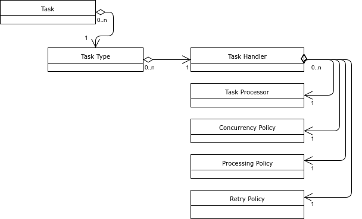
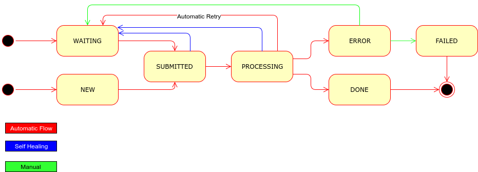

# TwTasks - TransferWise Tasks Executor


Service cluster-wide asynchronous tasks executor.

## What is it?

A framework for executing arbitrary asynchronous code in distributed way with full consistency guarantees.

Basically fire-and-forget-until-alert kind of system.

- Consistency
    - TwTasks guarantees that no set up task will go missing or is processed twice. We don't want to have missing payouts
    or double payouts.
    - TwTasks is able to detect and correctly handle a case, where a same task is tried to set up multiple times, usually because
    of receiving same Kafka message multiple times.
    - TwTask uses optimistic locking for most efficient consistency, even for manual intervention a version has to be always provided.
- Atomicity
    - TwTasks allows to set up tasks inside business logic and guarantees, that only when business logic is successfully
    committed, the set up tasks will be executed. If business logic will be rolled back, the set up tasks will be discarded.
    This will fix the issue we had with Artemis, where in some cases a message was sent before transaction was committed
    or in worse case rolled back.
- Low latency
    - TwTasks can provide sub-millisecond latency, so the task can be executed very quickly (even in other node) after
    business logic commits. Every payout has many asynchronous steps and we can not tolerate any latency when supporting
    instant payouts. The goal was to have exactly the same flow for normal and instant payouts, difference being, that
    instant payouts' tasks have just higher priority.
- Priorities
    - Higher priority tasks will be always run before lower priority tasks. We want instant payouts to have higher priority.
    - TwTasks allows even to stretch the maximum concurrency when all the processing slots are full for high priority tasks.
- Automatic retries
    - When a task fails with an unhandled exception, we can specify if and when it will be retried again. It is very common,
    that during a payout execution the Partner side has technical issues and in that case we would want to retry again after
    1 hour.
- Fault tolerance
    - When a service node or even the whole cluster crashes, we still want to keep our consistency and atomicity guarantees.
    - Not only crashes, but infrastructure problems (Kafka or Database down) are considered and handled.
- Self healing
    - After a crash or even a bug fix, the system is able to resume all the tasks set up, but still maintaining atomicity and
    consistency guarantees.
    - TwTasks has algorithms for in certain situation to safely recover and resume tasks very fast.
- Monitoring and Alerting
    - Sometimes a self healing is impossible (usually because of a bug) or too dangerous. For those cases TwTasks is able
    to notify engineers via logs, Rollbar and/or VictorOps.
    - TwTasks has also NewRelic and XRequestId support built in. It is relatively easy to track chained tasks and how performant
    every task is.
    - JMX and Grafana support is included as well. The engine provides lots of different JMX beans and metrics for its inner state.
    - When ever the engine deals with a specific task, its sets the task id into Slf4j MDC. This can be added into application's log row.
- Manual or automatic intervention
    - There is a need and possibility to stop a task, resume a task, retry a task or mark it as completely failed and thus turn off further alerts.
    - TwTasks provides programmatic and REST API for that. There is a Ninjas2 interface as well, based on that REST API.
- Sophisticated concurrency control
    - In order to protect the service from trashing because of too many concurrent threads/processes, TwTasks allows engineer
    to set up proper concurrency limits (lets say maximum of 10 processes in one node at one time). The concurrency control setup
    is very simple, but at the same time allows extremely complex scenarios, where for example we want to have 30 total processes,
    15 total payout execution, but not more than 5 per partner.
    - TwTasks is also solving the fundamental problem with all other queue based task executors - one slow task type, can not hinder
    the processing of other task types. Let's say, one of our partners is very slow and Ops just submitted 10000 of that partner Payouts.
    Just after those 10000 other Ops submitted 10 payouts for another partner. TwTasks will correctly understand in that case,
    that it can maybe execute maximum of 5 payouts for 1st partner, but in parallel already execute 2nd partner payouts as well.
    Other task executors would have to wait for 10000 1st partner payouts, before 2nd partner can even have chance.
    - Concurrency control is fully programmatic, one can easily write an implementation where we can even stretch the processing
    power for high priority tasks.
- Sharding
    - TwTasks provides even sharding, where some type of tasks are executed completely parallel from other tasks. It is useful
    to completely separate some components of service, for example slower payout flow and faster sending out emails or messages. The shards
    in TwTasks are called processing buckets.
- Graceful Shutdown
    - Even when TwTasks is crash tolerant, in usual cases we would like to keep the log and alerting spam minimal. TwTasks
    handles service shutdown, but also startup gracefully.
- Scheduled Tasks
    - When setting up a task, an engineer can specify, when a particular task should run - immediately or lets say after 1 hour.
    For payouts, it is very common, that some payouts execution (especially on retries) is desired to not run immediately, but
    at very specific time.
- Good Performance
    - Lots of effort is put into performance and efficiency. Local machine performance tests show about 1750 tasks set up and executed in a second.
    During that, CPU utilization is low and the bottleneck is underlying database, especially its commit (read fsync) speed.
    - 1750 tasks/s should always considered when designing algorithms based on TwTasks, for example its much more efficient to send
    batch of Kafka messages with one task, instead creating a separate task for every single message.
- Support for both synchronous and asynchronous tasks.
    - Payout execution for example is synchronous, but sending a Kafka message is asynchronous.
- Support for both Postgres and MySQL databases.
    - TransferWise uses both databases in different services.
- Cluster support
    - A task can be executed in any node having free processing power first. It is very common (actually 1/(nodes count) chance),
    that a task is set up by one node, but execution is happening on another node.
    - It is guaranteed, that even in a cluster, a task processing happens only in one node and only once.
    - Depending on a cluster size there are different triggering algorithms balancing latency, ordering and resource efficiency.
    - Self healing and task scheduling maintenance processes run only in one node (leader election) to maximize efficiency.

Design of TwTasks has avoided following practices and approaches.
- Triggering tasks by database polling (QueueEvent, Outgoing Messages)
Mainly because of latency and performance reasons. You can not have 1 ms latency with database polling approach.
Database polling is not used for usual tasks and happy flows, however it is still used for scheduled tasks (notice, that a retry is also handled
with a task scheduling), self healing and monitoring needs. However the polling has long interval and only one node in the cluster
does it. In the future a better algorithm could be designed for scheduled tasks.

## What TwTask is not for
Notice, that TwTask is for inner (micro-)service use. If you want to set up an asynchronous process in another service, you should
send a Kafka Message to that service instead and this service could set up a TwTask itself on receiving the message.

## Infrastructure
TwTask depends on and needs following infrastructure services.
- Zookeeper - leader election, locks, Kafka.
- Kafka - triggering tasks.
- Database - holding tasks data and state.

## Quick Start

##### Add dependencies
```groovy
implementation("com.transferwise.tasks:tw-tasks-core-spring-boot-starter:${twTasksVersion}")
implementation("com.transferwise.tasks:tw-tasks-kafka-listener-spring-boot-starter:${twTasksVersion}")
implementation("com.transferwise.tasks:tw-tasks-management-spring-boot-starter:${twTasksVersion}")

testImplementation("com.transferwise.tasks:tw-tasks-core-test:${twTasksVersion}")
```

##### Create database tables
- [MySQL/MariaDB/Percona](tw-tasks-core/src/main/resources/db/changelog/db.tw-tasks-mysql.xml)
- [Postgres](tw-tasks-core/src/main/resources/db/changelog/db.tw-tasks-postgres.xml)

##### Add at least following configuration options
```yml
tw-tasks:
  core:
    group-id: MyFancyServiceName # Use only symbols suitable for Kafka topic!
    db-type: MYSQL
```

##### Create Kafka topic
(If your server does not support auto topic creation)

`twTasks.MyFancyServiceName.executeTask.default`
- partitions count should be usually the service nodes count + canaries count.

##### Configure Zookeeper access by providing CuratorFramework bean.

- [*Recommended way of setting up curator*](https://github.com/transferwise/tw-curator)

- Manual way of setting up curator:
```java
@Bean(destroyMethod = "close")
public CuratorFramework curatorFramework() {
    CuratorFramework curatorFramework = CuratorFrameworkFactory.builder().connectString(connectString).build()
    curatorFramework.start();
    return curatorFramework;
}
```

##### Configure Kafka access by configuring Spring-kafka module
```yaml
spring:
  kafka:
    bootstrap-servers: host.local:9092
    client-id: MyFancyServiceName
    consumer:
      groupId: 'payout-service'
      enableAutoCommit: false
```

##### Execute Your First Task
First, provide a task handler.
```java
@Bean
public ITaskHandler helloWorldTaskHandler() {
    return new TaskHandlerAdapter(task -> task.getType().startsWith("HELLO_WORLD_TASK"), (ISyncTaskProcessor) task -> System.out.println("Hello World!"))
        .setConcurrencyPolicy(taskConcurrencyPolicy())
        .setProcessingPolicy(new SimpleTaskProcessingPolicy().setMaxProcessingDuration(Duration.ofMinutes(30)))
        .setRetryPolicy(new ExponentialTaskRetryPolicy().setDelay(Duration.ofSeconds(5)).setMultiplier(2).setMaxCount(20).setMaxDelay(Duration.ofMinutes(120)));
}
```
Register a Task Execution.
```java
tasksService.addTask(new ITasksService.AddTaskRequest().setType("HELLO_WORLD_TASK"));
```

Write a port-level integration spec.

Profit!

##### In Production you want to enable alerts
```yaml
tw-incidents:
  victorops:
    enabled: true
    notify-base-url: https://alert.victorops.com/integrations/generic/12345678/alert/
    routing-key: my-fancy-team
    api-token: my api token that comes after the "/alert/" bit in the Victorops URL to notify
```

## Tasks in production, Best Practices
Always resolve tasks in ERROR state ASAP (mark as FAILED or for reprocessing).
Only in that case there will be any value in Rollbar alerts and VictorOps incidents.
If you have functionality that tends to create FAILED tasks but is not critical to complete, just make the handler not fail on the last retry.

Tasks that are still `WAITING` for next retry (not in `ERROR` state yet) can be triggered sooner than it's `nextEventTime` by using _Resume_ feature in Ninjas2.

## A Task
The central piece of TwTasks is of course a task.

A task is essentially a record in the database, with following important attributes.

- Type
A unique identifier of a type of task. A task handler and thus everything else is found by this type.
For example `SEND_EMAIL`. A type can sometimes contain other information to help concurrency policy or processing policy.
For example, in case of `DELIVER_BATCH|PARTNERX`, Payout Service's Concurrency Policy can apply a special rules for PARTNERX partner.
- Data
Task payload. Huge payloads are fully supported, however for performance reasons it is recommended to not use them.
Even when there is a need for huge payload, the actual payload could be kept somewhere else and only reference to it is
added into Data field.
- NextEventTime
Indicates when something should happen with the task, depending on a context.
Could be when stuck task detector is kicked in, but also when a task needs to be executed (as a scheduled task).
We use one field for multiple contexts, to have extremely efficient and small index capable supporting all cases.
- ProcessingTriesCount
How many times the task has been tried to processed. This is commonly used to decide if and when a next retry should happen.
- Priority
In default configuration 0-9, with default being 5.
- Status
- Id
Unique UUID either autogenerated or provided by the application.
- Subtype
Just for clarity, not used by the engine. For example, in Kafka Messages sending task it could be the destination topic.

A task can be added and scheduled with `com.transferwise.tasks.ITasksService.addTask`, further documentation can be found in its JavaDoc.

## A Task Handler
A task processing is driven by a task handler, which supports the engine with task processor, retry policy, concurrency policy,
processing policy and retry policy.



One task handler can support multiple task types. Also any processor or retry policy can support multiple task handlers and so
indirectly multiple task types as well.

In many cases a TwTasks shard has only one central Concurrency Policy, to control the all concurrency from single place
(e.g. if maximum number of 30 threads has to be forced).

A task processor is always provided by an engineer, whereas all the policies have one or many default implementation, e.g. `ExponentialTaskRetryPolicy`.

## Task State Machine


## Useful implementations provided by TwTasks using the TwTasks engine
1. Consistently sending Kafka Messages
Can be done using `com.transferwise.tasks.impl.tokafka.IToKafkaSenderService`. Consult its JavaDoc for usage.
Using this you get same guarantees, monitoring and alerting as for any other task.

2. Cluster wide periodic jobs.
Usually this is done by Quartz, but Quartz has many problems. It is too heavyweight and it actually can still execute same job
in multiple nodes at the same time, so it does not give you any guarantees, even when configured "correctly".

The trick with TwTasks is to provide a RetryPolicy, which never stops Retrying.

```java
@Component
public class SampleCronRegistrar {
    // The UUID is generated by engineer and hardcoded. This can also be used later for any kind of manual intervention.
	private static final UUID UUID_SAMPLE_CRON = UUID.fromString("5c60b661-6d2b-43ac-974e-434512f776a0");

	@Autowired
	private ITasksService tasksService;

	@PostConstruct
	public void init() {
		/*
		 * This is fast no-OP when task with same UUID is already present.
		 * We set runAfterTime value, so all nodes will have time to get SampleCronTaskHandler released.
		 * Otherwise there is a chance that the task goes immediately to ERROR state, because the node choosed for execution
		 * does not have the handler released yet.
		 */
		tasksService.addTask(new ITasksService.AddTaskRequest()
				.setTaskId(UUID_SAMPLE_CRON).setType(TT_SAMPLE_CRON).setRunAfterTime(ZonedDateTime.now().plusHours(1)));
	}
}
```

```java
@Component
@Slf4j
public class SampleCronTaskHandler extends TaskHandlerAdapter {
	public static final String TT_SAMPLE_CRON = "SAMPLE_CRON";

	public SampleCronTaskHandler() {
		super(s -> s.equals(TT_SAMPLE_CRON), (ISyncTaskProcessor) task -> {
			// Do the work
			log.info("Alive and kicking!");
			// We could throw an exception for a retry, but TwTasks also provide special, spam(logs) free, return code.
			return new ISyncTaskProcessor.ProcessResult().setResultCode(ISyncTaskProcessor.ProcessResult.ResultCode.COMMIT_AND_RETRY);
		});
		setRetryPolicy(new ITaskRetryPolicy() {
			@Override
			ZonedDateTime getRetryTime(Task task) {
				return ZonedDateTime.now().plusMinutes(45); // We could also use CronUtils here, if we would want to use cron expressions.
			}
			@Override
			boolean resetTriesCount() {
				return true; // Don't increase the task tries count when job was correctly processed.
			}
		});
	}
}
```

3. Listening Kafka Messages
You have to provide an implementation Bean for `IKafkaMessageHandler` and that's it. You get
- Fallback sites support.
- Automatic consistent commits.
- Spamless(logs) failover and re-balancing.

4. Translating Kafka Messages into Tasks.
You have to provide an implementation Bean for `KafkaMessageToTaskConverter` and that's it.

```java
@Bean
public KafkaMessageToTaskConverter processConfirmationsMessageToTaskConverter() {
    return new KafkaMessageToTaskConverter<>(ProcessConfirmationsCommand.class, (event, cr, tr) -> {
        // If you return false, the message will be ignored, no task created. This can be used to filter out messages.
        tr.setTaskId(event.getUuid()) // We use event's UUID for deduplication. Notice that if task already exists with that UUID, nothing is done.
                .setDataString(cr.value())
                .setType("PROCESS_CONFIRMATIONS")
                .setSubType(event.getTransferMethod());
        return true;
    }, new IKafkaMessageHandler.Topic().setAddress("PROCESS_CONFIRMATIONS_COMMANDS").setSuggestedPartitionsCount(4));
}
```

If you have more than one message processor *for the same topic* in same service, you can create a variation of message uuid:
```
.setTaskId(new UUID(event.uuid.getMostSignificantBits(), event.uuid.getLeastSignificantBits() + 1))

```

## Examples
1. Setting up a task handler.
A Bean implementing `ITaskHandler` needs to be defined.
For simplicity we use `TaskHandlerAdapter`.
```java
@Bean
public ITaskHandler executePayoutTaskHandler() {
    return new TaskHandlerAdapter(task -> task.getType().startsWith("EXECUTE_PAYOUT"), (ISyncTaskProcessor) task -> {
        ExecutePayoutCommand command = jsonConverter.toObject(task.getData(), ExecutePayoutCommand.class);
        payoutService.executePayout(command);
        return new ISyncTaskProcessor.ProcessResult().setResultCode(ISyncTaskProcessor.ProcessResult.ResultCode.DONE);
    })
    .setConcurrencyPolicy(payoutTaskConcurrencyPolicy)
    .setProcessingPolicy(new SimpleTaskProcessingPolicy().setMaxProcessingDuration(Duration.ofMinutes(30))
            // make sure to include this bucket in the `tw-tasks.core.additional-processing-buckets` list
            .setProcessingBucket("payout"))
    // 5s 20s 1m20s 5m20s 20m
    .setRetryPolicy(new ExponentialTaskRetryPolicy()
            .setDelay(Duration.ofSeconds(5))
            .setMultiplier(4)
            .setMaxCount(5)
            .setMaxDelay(Duration.ofMinutes(20)));
}
```
2. Setting up a task for execution.
Let's assume, we want a payout done after 1 hour.
```java
tasksService.addTask(new ITasksService.AddTaskRequest().setType("EXECUTE_PAYOUT")
.setData(executePayoutCommand).setRunAfterTime(ZonedDateTime.now().plusHours(1)));
```
3. Implementing a specific ITaskConcurrencyPolicy.
Let's assume, we want to have maximum of 5 payouts per node, but not more than 2 per partner.
Our task types have partner info inside, for example `EXECUTE_PAYOUT|PARTNERY`.

Groovy code:
```groovy
class PayoutTaskConcurrencyPolicy implements ITaskConcurrencyPolicy {
	private AtomicInteger inProgressCnt = new AtomicInteger()

	private Map<String, AtomicInteger> inProgressCntsPerType = new ConcurrentHashMap<>()

	@Override
	boolean bookSpaceForTask(BaseTask task) {
		int maxConcurrency = 5

		int cnt = inProgressCnt.incrementAndGet();
		if (cnt > maxConcurrency) {
			inProgressCnt.decrementAndGet();
			return false;
		}

		// Overall concurrency is satisfied, lets check per partner concurrency as well.
		String transferMethod = getTransferMethod(task);
		if (transferMethod != null) {
			int maxConcurrencyPerTransferMethod = 2

			AtomicInteger inProgressCntPerType = getOrCreateTypeCounter(transferMethod);
			if (inProgressCntPerType.incrementAndGet() > maxConcurrencyPerTransferMethod) {
				inProgressCntPerType.decrementAndGet();
				inProgressCnt.decrementAndGet();
				return false;
			}
		}
		return true;
	}

	@Override
	void freeSpaceForTask(BaseTask task) {
		String transferMethod = getTransferMethod(task);
		if (transferMethod != null) {
			if (getOrCreateTypeCounter(transferMethod).decrementAndGet() < 0) {
				throw new IllegalStateException("Type counter for '" + transferMethod + "' went below zero. Algorithm error detected.");
			}
		}

		if (inProgressCnt.decrementAndGet() < 0) {
			throw new IllegalStateException("Counter went below zero. Algorithm error detected.");
		}
	}

	private AtomicInteger getOrCreateTypeCounter(String type) {
		AtomicInteger counter = inProgressCntsPerType.get(type);
		if (counter == null) {
			synchronized (this) {
				if (counter == null) {
					inProgressCntsPerType.put(type, counter = new AtomicInteger());
				}
			}
		}
		return counter;
	}

	protected String getTransferMethod(BaseTask task) {
		return StringUtils.trimToNull(StringUtils.substringAfterLast(task.getType(), "|"));
	}
}
```

## Additional Configuration

TwTasks expects `tw-incidents` and `tw-graceful-shutdown` dependencies to be present and activated.

TwTasks works more efficiently with a proper JTA transaction manager than with Spring default one, even with only one database.

Engine configuration is described with and in `com.transferwise.tasks.TasksProperties`.

When using additional shards to the default one, TwTasks must be told about them by setting the
`additional-processing-buckets` property within the engine configuration. **Failure to do so will result in tasks
submitted to those buckets not being processed, and instead being sent to the error state.**

When using multiple shards, a shard can further configured by registering a `com.transferwise.tasks.buckets.BucketProperties` instance via
`com.transferwise.tasks.buckets.IBucketsManager.registerBucketProperties`.

When Kafka does not allow topics to be auto created, following topics have to be created by hand:
- `twTasks.<group-id>.executeTask.default`

And one topic for each additional bucket:
- `twTasks.<group id>.executeTask.<bucket id>`.

Reference application where a configuration can be basically copied from is `demoapp`.

To be able to see a task payload in production you have to configure which roles are able to do it. Any user with a suitable role will be
able to see tasks plain payload, but the user and what data they queried will be logged.
- `tw-tasks.core.tasks-management.view-task-data-roles`

```yaml
tw-tasks:
  core:
    tasks-management:
      view-task-data-roles:
        - ROLE_PAYIN_DEVEL
        - ROLE_TW_TASK_VIEW
```

### Custom Kafka Configuration
`tw-tasks` library can be configured with custom Kafka config by defining `TwTasksKafkaConfiguration` bean in your application:
```java
@Bean
public TwTasksKafkaConfiguration twTaskKafkaConfiguration() {
    KafkaProperties props = ...;
    KafkaTemplate<String, String> template = ...;

    return new TwTasksKafkaConfiguration(props, template);
}
```

## Algorithms Used
Some engineers want to understand how the engine actually works and which algorithms and tricks are used.

1. Post Transaction Hook.
When a task is added, we register a post transaction hook. Immediately, after a commit has finalized, the task is triggered. In
a case of rollback, nothing is done and can't be done, because the task record is "removed" from database.
Currently there is one hook per task registered (for simplicity).

This approach is allowing us to skip the database polling on happy flow and basically have minimum latency for starting the
task processing.

2. Triggering Tasks with Kafka.
First, it is important to understand, the task processing have its own consistency guarantees. When a node tries to move
task from SUBMITTED->PROCESSING, it needs to also provide the expected version. If the task version has changed, this operation fails.
Basically an atomic operation using optimistic locking with a version field. So any node can try to move a task to processing
(we call it grabbing a task), at the same time, multiple times; but only one grabbing succeeds.

Now, because the task grabbing is safe and consistent, we can use more relaxed triggering mechanism, i.e. this does not have to
be consistent, can contain duplicate triggers and what not.

So the Kafka topics were chosen as a triggering channels. Every shard has its own triggering topic and the triggering message
is basically very small and concrete - "Trigger task with id X and version Y."

Any node, which receives this message will try to trigger the task.

3. Look-ahead triggerings fetching and processing.
The number of topics, or actually the number of partitions is actually a scarce resource in Kafka. The limitation is not
coming from Kafka itself, but from the Zookeeper underneath it.

One can write a system, where for example every task type and task priority has its own triggering topic, but this will not scale.

So an approach where we have one triggering topic (per shard), but we fetch a lot from the queue into memory, was choosed.
We have of course an upper limit how far ahead can we look.

This kind of look ahead fetch into memory allows us to "sort" tasks by priority, available processing power per type and so on.

4. Sorted task triggerings table.
Triggerings are fetched into very specific data structure, which goal is to provide a next task for processing with maximum of logN complexity.

From this data structure, the system is finding a next task for execution. If it finds one, it stops, schedules the task execution in another thread and
starts again (searches a next task).

There is one table per priority. Next task is always searched from highest priority table to lowest. If the task type has
no available processing slots in higher priority, it is assumed, it can not have it in lower priority as well (very reasonable assumption).

Table for one priority looks like following.

SEND_EMAIL            | SEND_KAFKA_MESSAGE | EXECUTE_PAYOUT
----------------------|--------------------|---------------
1                     | 2                  | 4
3                     | 5                  |

The numbers are sequence numbers, i.e. the order in which task triggering was received from Kafka (most of the time, also the
order in which tasks were added).

Table is always keeping the order, that type with lowest order tasks are always left. For example, if we would take SEND-EMAIL-1 out,
the first and second column will change places.

The algorithm searches from left to right and looks only the first sequence number in specific type's queue. Then it tries
to book a processing slot for it's type. If processing slots are full, it tries with next type. If a type has been marked as full in
higher priority table, the type is not even checked anymore.

When we successfully booked a processing slot we remove that task from the table. The node will try to grab the task (via optimistic locking).
If grabbing succeeds, the task will be processed. If grabbing fails, we assume that another node already grabbed it or
manual intervention happened and we just ignore it.

So if for above table, the SEND_EMAIL processing slots where full, but we were able process SEND_KAFKA_MESSAGE, the table looks like

SEND_EMAIL            | EXECUTE_PAYOUT     | SEND_KAFKA_MESSAGE
----------------------|--------------------|---------------
1                     | 4                  | 5
3                     |                    |

5. Concurrency control with booking system
A booking system was decided to use. It is very simple, yet very powerful.

Basically the engine will try to book a processing slot, before grabbing and executing a task. And once the task has been executed
it will free (de-book) the slot so it will be available for next tasks.

The booking registration is handled by implementation of `ITaskConcurrencyPolicy` where in its simples form it can be just
increasing and decreasing an atomic integer (`SimpleTaskConcurrencyPolicy`). On the other end of complexity spectrum, it could
be reserving and freeing Zookeeper's Semaphores to have cluster wide concurrency limit. Or have so called concurrency hierarchy, for
example 30 total, but 15 total for payout tasks, but only 3 total for one partner payout executions.

6. Programmatic configuration
An engineer can provide different Task handling policies for controlling retries, concurrency, sharding and they all
can be (re) implemented having as simple or complex logic as needed. Something which is extremely hard to achieve with
property based config.
It is always possible to write another layer providing full property based config on top of it, but the value added is
very questionable.

7. Cluster nodes are not aware of each other
The approach where cluster nodes communicate with each other to make decisions will never work in the long run (hazelcast, jgroups).
In a good micro service architecture, the service cluster nodes should only communicate and indirectly coordinate their work with other separate shared
services (kafka, zookeeper, database).

8. Database polling
Database polling is avoided for happy flows, however no better algorithm has come to mind for scheduled tasks or for checking
if any task is stuck or in ERROR state.

So one node for each of the following tasks is picked and it does database polling.
1. Triggering Scheduled (WAITING state) tasks.
By default after every 5 seconds one node polls from database WAITING tasks which next_event_time has passed, and sends
out Triggering Events into Kafka.
2. Cleaning old tasks.
One node is polling database for old tasks and if found, deletes them.
3. Finding and resuming stuck tasks (Self healing)
One node is polling database for tasks in not WAITING or final states where next_event_time has passed. It logs out
a warning and resumes those.
4. Incidents generator
Because the tw-incidents does not have leader election (Yet), all nodes are currently quering database for stuck tasks (which haven't self healed)
and erroneous tasks and generating alerts (e.g. into VictorOps) for those.

## Support for integration tests
For making integration testing easy and fun, the following support classes can be used. They are especially convinient for
tasks with Json payload.

- `IToKafkaTestHelper`
- `ITestTasksService`

Notice, that you need to define those two beans yourself, they are not created via auto configuration.

Because the TwTasks is used for asynchronous logic, you may want to commit your test data, before starting a test. For
that `ITransactionsHelper` can be used.

For very specific and extreme cases a `ITaskDao` can be directly injected and used.

## Support for pure Spring and Grails applications.
Basically a copy-paste of current auto-configuration class has to be done. Our conditionals are Spring Boot based and will not work there.

No out-of-the box copy-paste free support is currently intended for other than Spring-Boot type of applications.

## License
Copyright 2019 TransferWise Ltd.

Licensed under the Apache License, Version 2.0 (the "License");
you may not use this file except in compliance with the License.
You may obtain a copy of the License at

http://www.apache.org/licenses/LICENSE-2.0

Unless required by applicable law or agreed to in writing, software
distributed under the License is distributed on an "AS IS" BASIS,
WITHOUT WARRANTIES OR CONDITIONS OF ANY KIND, either express or implied.
See the License for the specific language governing permissions and
limitations under the License.
